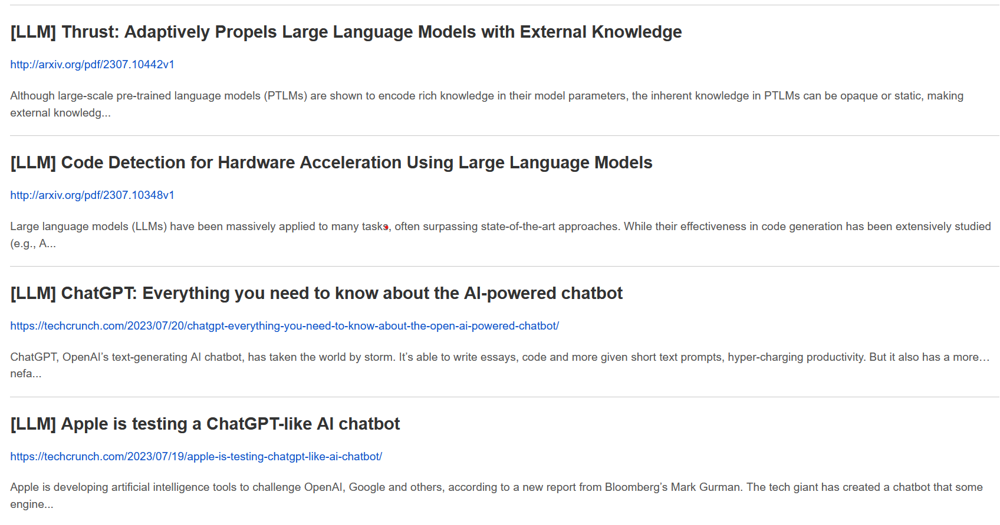

.. _usage:

.. _here: https://myaccount.google.com/lesssecureapps

Usage
=====
Below, a simple example of how to run **SciWatch** for monitoring LLM, document augmentation, and Active Learning papers,
and blogs.

Setup senders
-------------

See :ref:`senders`.

Create a configuration file
---------------------------

Lets suppose we named the file :code:`scrapping_config.toml`.

.. code-block:: toml

    title = "LLM & AL Watch" # Will be used as email title

    end_date = "now" # will search content up to now (exec. time)
    time_delta = "02:00:00:00" # will look for content up to two days ago

    recipients = ["aghiles.ahmed.azzoug@gmail.com"]

    # define your queries
    [[query]]
    title = "LLM" # LLM query
    raw_content = """intitle:(GPT* OR LLM* OR prompt* OR "Large language models"~2) AND incontent:(survey OR review OR evaluation* OR benchmark* OR optimization*)"""

    [[query]]
    title = "AL" # Active Learning on VRD (or benchmarks/surveys)
    raw_content = """intitle:("active learning") AND incontent:(VRD OR documents OR survey* OR benchmark*)"""

    # define your sources
    [[source]]
    type = "arxiv" # check for Computer Science papers on Arxiv
    use_abstract_as_content = true
    search_topic = "cs"
    max_documents = 500 # should be one of 25, 50, 100, 250, 500, 1000, 2000

    [[source]]
    type = "openai_blog" # check for latest blogs on OpenAI blog (mainly for GPT updates)
    max_documents = 20

For more information about query syntax see :ref:`query`.

Run the watcher
---------------

.. code-block:: python

    from sci_watch.sci_watcher import SciWatcher

    watcher = SciWatcher.from_toml("scrapping_config.toml")

    watcher.exec() # if some relevant content is retrieved, recipients will receive an Email

You might get an email like this:

.. tip::
    You can run your code through Crontab and receive daily (or weekly) updates!
